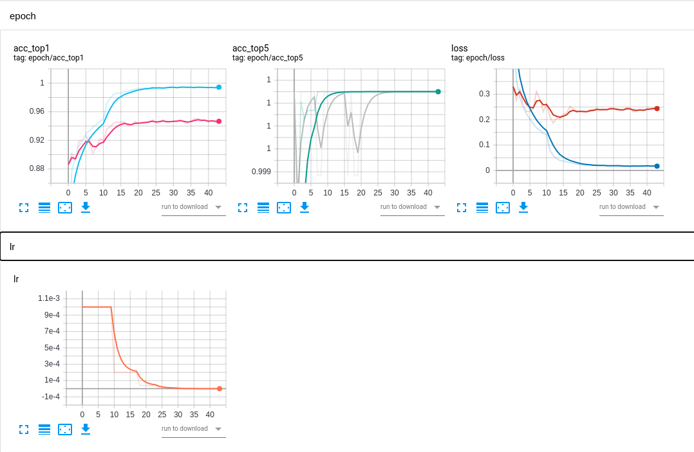
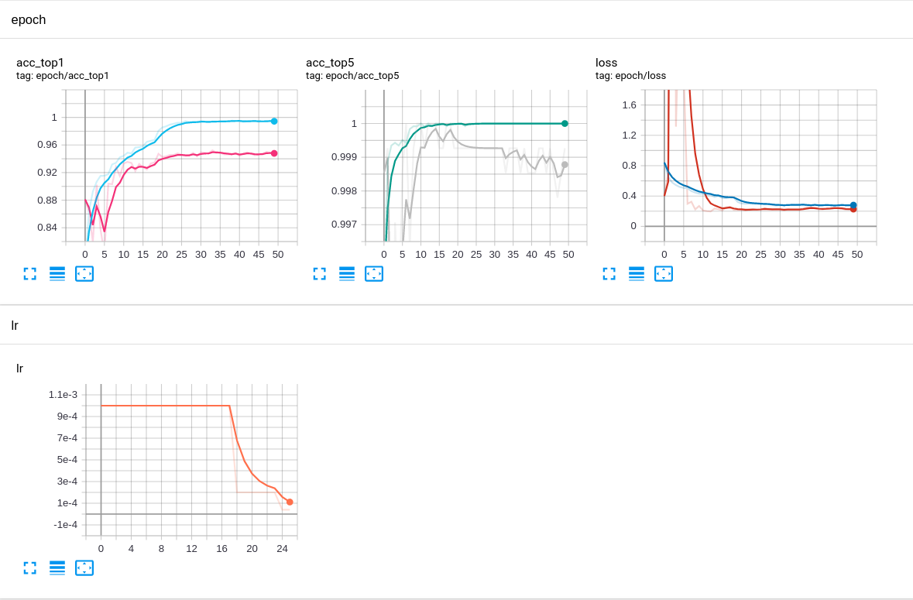

# Scene-Classification-Competition
secene classification competition

## Description 
[图像场景分类挑战赛 ](https://god.yanxishe.com/97?from=god_home_list)

**数据都是世界各地的风景图片，共有6类，buildings、street、forest、sea、mountain、glacier。选手需要建立并训练模型识别测试图片所属的分类。**

## Dataset

<https://data.yanxishe.com/Image_Classification.zip>

## Metrics

$$Score = \frac{True}{Total}$$

## Train Logs

### baseline

* image augmentation with erasing

* test acc: 92.2512

  

### update 2020/11/12

* training with mixup strategy 
* bias not use weight_decay

* test acc: 93.7482

  

## TODO

## Reference
<https://github.com/QLMX/huawei-garbage>

